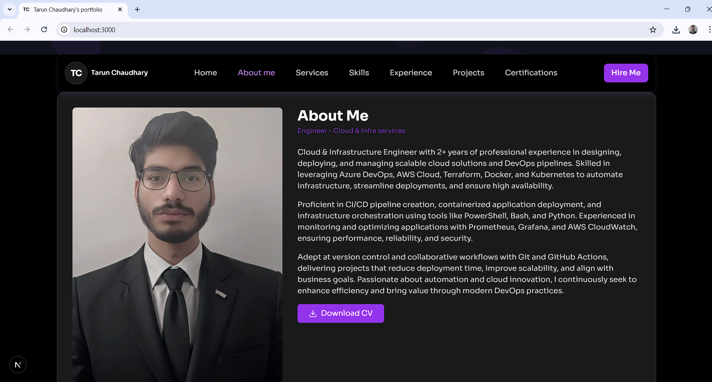

# portfolio
This is my live portfolio website 

This is the Home page of the project.

This is the About page of the project.

---
Prerequisites
1- NodeJs
2- npm
3- Clone repo
4- Got to root directory of project
---
Running this project locally includes running basic node js commands to run any project.
---
First Install required dependencies.
Step-1: Go to the root directory
Step-2: Run below commands.
        #npm install
Step-3: Run the project.
        #npm run dev
---
